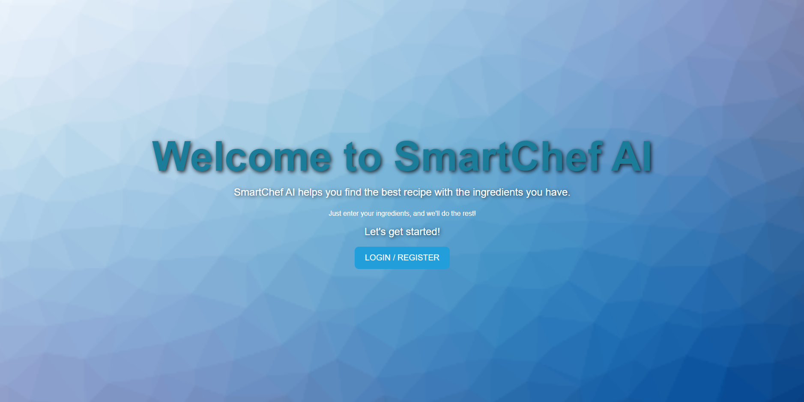
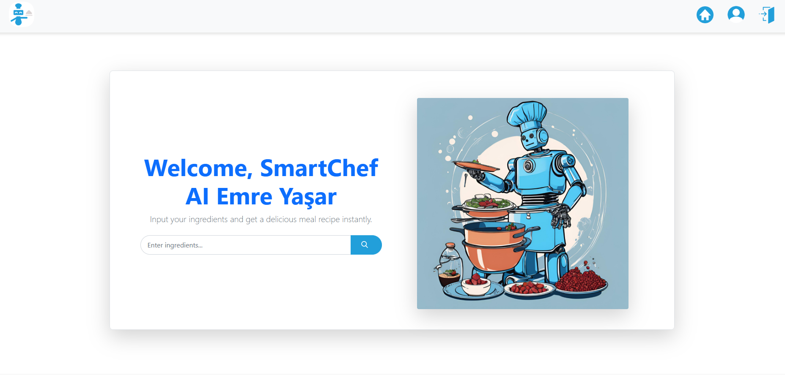
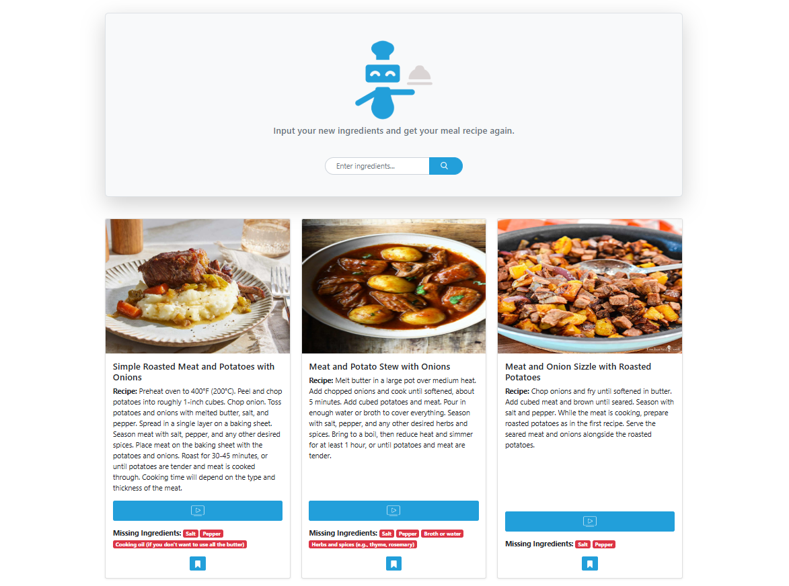
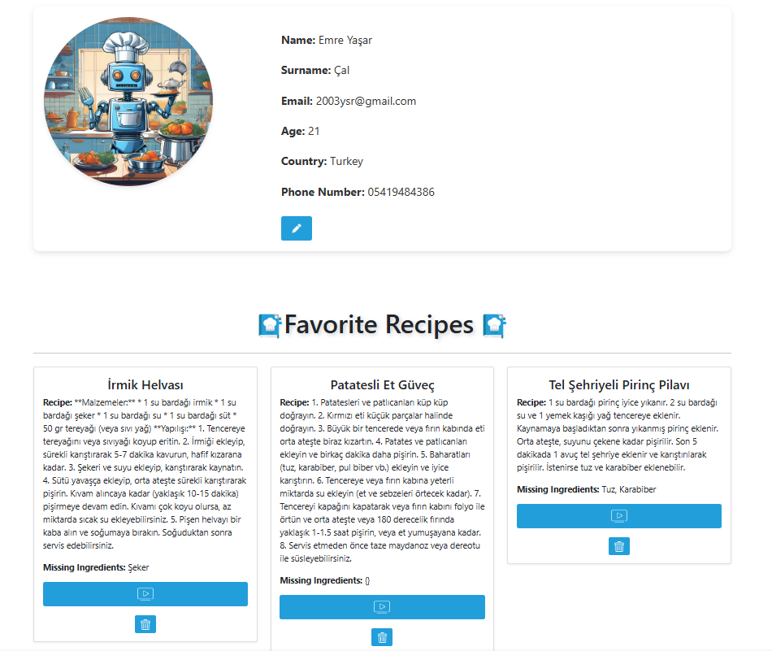

<h1 align="center">SMARTCHEF-AI</h1>


<div align="center"> 
<table>
  <tr>
    <td></td>
    <td></td>
  </tr>
  <tr>
    <td> </td>
    <td></td>
   
  </tr>
  <tr>
     <td></td>
  </tr>
</table>


[**Explore the Docs »**](https://github.com/Emreysrcl/SmartChef-AI)

[**Try SmartChef-AI Now »**](https://smartchef-ai-production.up.railway.app)

</div>

---

## **About The Project**

**SmartChef-AI** is a web application where users can generate AI-powered recipes based on available ingredients, discover meal ideas, and connect with fellow food enthusiasts. The platform allows users to share their meals, add descriptions, save recipes, and explore dishes from others. It integrates Google Generative AI for recipe suggestions and Google Custom Search API for retrieving relevant meal images, while using PostgreSQL for data management, offering an engaging and efficient cooking experience.

---

## **Key Features**

- ✅ User Registration & Login – Secure authentication system with personalized user profiles.
- ✅ AI-Powered Recipe Generation – Create unique recipes based on available ingredients.
- ✅ Explore & Save Recipes – Browse AI-generated meals and save favorites.
- ✅ Responsive Design – Optimized for seamless use on desktop and mobile devices.
- ✅ Automatic Image Retrieval – Fetch relevant meal images using Google Search API.

---

## **Built With**

- [Node.js & Express.js](https://nodejs.org/en) - Backend framework  
- [EJS](https://ejs.co) - Template engine for dynamic content  
- [PostgreSQL](https://www.postgresql.org) - Database for storing user data and meals  
- [Bootstrap](https://getbootstrap.com) - Styling and responsive design  
- [Multer](https://github.com/expressjs/multer) - Handling image uploads  
- [CSS](https://www.w3schools.com/css/) - Additional styling
- [Google Custom Search API](https://developers.google.com/custom-search/v1/overview?hl=tr) - Retrieves relevant meal images from the web
- [Google Generative AI](https://ai.google.dev/aistudio?hl=tr) - Powers AI-driven recipe generation based on user input

---

## **Getting Started**

### **Prerequisites**
Ensure you have the following installed:
- [Node.js](https://nodejs.org/)
- [PostgreSQL](https://www.postgresql.org/)
- [Git](https://git-scm.com/)

### **Installation**

 **Clone the repository:**
   ```sh
   git clone https://github.com/Emreysrcl/SmartChef-AI.git
   ```
 **Navigate to the project directory:**
   ```sh
   cd SMARTCHEFAI
   ```
 **Install dependencies:**
   ```sh
   npm install
   ```
 **Set up the database:**
   - Create a PostgreSQL database.
   - Run the provided SQL scripts in `queries.sql` to set up the necessary tables.
 **Configure environment variables:**
   - Create a `.env` file in the root directory.
   - Add the required variables (e.g., database connection string, secret keys).
 **Start the server:**
   ```sh
   npm start
   ```
   *Server will run on http://localhost:3000*

---

## **Usage**

 **Sign up/Login** – Create an account to start sharing your meals.
 **Generate Recipe** – Input your available ingredients and let the AI suggest creative recipes based on them.
 **Save Recipe** – Save your favorite AI-generated recipes or meals shared by others for easy access.


---

## **Contributing**

Contributions are welcome! Feel free to fork the repository, make changes, and submit a pull request.

---

## **License**

Distributed under the MIT License. See [MIT License](https://opensource.org/licenses/MIT) for more details.

---

## **Contact**

👤 **Emre Yaşar Çal**  
- **X:** [@Zaytexss](https://twitter.com/Zaytexss)  
- **Email:** 2003ysr@gmail.com  
- **LinkedIn:** [Emre Yaşar Çal](https://www.linkedin.com/in/emre-ya%C5%9Far-%C3%A7al-3562ab203/)  
- **Instagram:** [@emreysrcl](https://www.instagram.com/emreysrcl/?hl=tr)  

**Project Link:** [SmartChef-AI](https://github.com/Emreysrcl/SmartChef-AI)

---

## **Acknowledgments**

Shoutout to the amazing tools and resources used in this project:

- [Bootstrap](https://getbootstrap.com) – For responsive UI design
- [Multer](https://github.com/expressjs/multer) – For handling image uploads
- [PostgreSQL](https://www.postgresql.org/) – Database management
- [Node.js & Express](https://nodejs.org/en) – Backend framework
- [Google Custom Search API](https://developers.google.com/custom-search/v1/overview?hl=tr) - For retrieves relevant images for meals and recipes.
- [Google Generative AI](https://ai.google.dev/aistudio?hl=tr) - For AI-driven recipe generation based on user input


---

_Enjoy sharing your meals and discovering new recipes with **SMARTCHEF-AI!**_ 🤖

